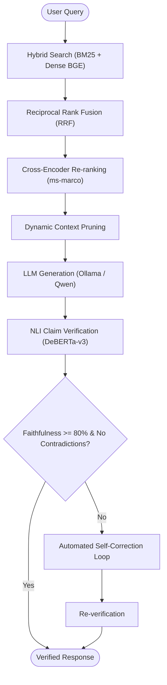

# Grounded RAG with Citation Verification & Self-Correction

A production-grade, hallucination-resistant Retrieval-Augmented Generation (RAG) system built with **Hybrid Search**, **Cross-Encoder Re-ranking**, **Sentence-Level NLI Verification**, and **Automated Self-Correction**.

---

## Overview

Standard RAG systems often suffer from hallucinations, unsupported claims, and ungrounded statements. This project implements a fully local, verifiable RAG pipeline on the **Financial Opinion Mining and Question Answering (FiQA)** dataset. It ensures every generated claim is explicitly attributed to a retrieved source document and verified via Natural Language Inference (NLI) before final output.



---

## Key Features

- **Hybrid Retrieval (Sparse + Dense)**:
  - **BM25s**: Fast sparse lexical matching using PyStemmer tokenization and Lucene BM25 scoring.
  - **Dense Embeddings**: Semantic retrieval using `BAAI/bge-small-en-v1.5` with normalized cosine similarity.
  - **Weighted RRF**: Reciprocal Rank Fusion combining sparse and dense candidate pools.
- **Cross-Encoder Re-ranking**: Two-stage retrieval using `cross-encoder/ms-marco-MiniLM-L12-v2` for precise semantic scoring of query-passage pairs.
- **Dynamic Context Pruning**: Extracts only the most relevant sentences per document to minimize prompt distraction and context length.
- **Strict Grounded Generation**: Prompts the LLM (via local Ollama) to generate stand-alone sentences with inline citation tags (`[Document N]`).
- **NLI-Powered Citation Verification**:
  - Uses `cross-encoder/nli-deberta-v3-base` to classify each sentence against cited source passages as `SUPPORTED`, `CONTRADICTED`, `UNSUPPORTED`, `INVALID_CITATION`, or `NO_CITATION`.
  - Granular premise windowing (single and adjacent sentence pairs) to eliminate premise dilution.
- **Automated Self-Correction**: Re-prompts the model with targeted negative feedback to rewrite or excise unverified/contradicted claims.
- **Interactive Interfaces**:
  - **Streamlit Web UI** (`web_app.py`): Real-time token streaming, side-by-side NLI inspection, confidence scores, and source inspection.
  - **CLI REPL** (`app.py`): Terminal interface with runtime toggle commands (`:k`, `:prune`, `:rerank`).
- **Comprehensive Evaluation Suite**:
  - Retrieval benchmark (NDCG@10, MRR@10, Recall@10).
  - End-to-end RAG metrics (Faithfulness, Citation Coverage, Validity, Contradiction Rate, Latency breakdown).

---

## Repository Structure

```text
├── app.py                      # Interactive CLI REPL application
├── web_app.py                  # Streamlit web dashboard
├── evaluate.py                 # Comprehensive retrieval & end-to-end evaluation suite
├── generator.py                # LLM answer generation & self-correction prompts (Ollama)
├── citation_verifier.py        # NLI claim splitter & DeBERTa verification engine
├── citation_checks_simple.py   # Citation index & range validation helpers
├── hybrid_search.py            # End-to-end hybrid retrieval orchestration
├── bm25_retriever.py           # BM25 indexing and search implementation (bm25s)
├── dense_retriever.py          # BGE dense embedding indexing & search
├── reranker.py                 # Cross-encoder re-ranking module
├── rrf.py                      # Weighted Reciprocal Rank Fusion implementation
├── download_fiqa.py            # Dataset downloader (BeIR/fiqa via HuggingFace)
├── explore_data.py             # Dataset EDA and inspection utility
├── train_biencoder.py          # Bi-encoder fine-tuning with MultipleNegativesRankingLoss
├── train_biencoder_lora.py     # Parameter-efficient LoRA fine-tuning for bi-encoder
├── train_crossencoder.py       # Cross-encoder fine-tuning
├── compare_retrieval.py        # Pre- vs Post-fine-tuning retrieval benchmark
├── compare_reranker.py         # Cross-encoder re-ranker benchmark
├── compare_lora.py             # LoRA vs Full fine-tuning comparison
├── requirements.txt            # Project dependencies
├── data/                       # Parquet corpus, queries, and qrels (downloaded)
└── indexes/                    # Persisted BM25 and Dense index files
```

---

## Getting Started

### 1. Prerequisites

- Python 3.10+
- [Ollama](https://ollama.ai/) installed and running locally
- Pull the generation model:
  ```bash
  ollama pull qwen3:4b
  ```

### 2. Installation

Clone the repository and install the dependencies:

```bash
pip install -r requirements.txt
```

### 3. Data & Index Setup

1. **Download the FiQA Dataset**:
   ```bash
   python download_fiqa.py
   ```
2. **Build Retrieval Indexes**:
   ```bash
   python bm25_retriever.py
   python dense_retriever.py
   ```

---

## Running the Applications

### Interactive Web Application (Streamlit)
Launch the web interface for streaming responses, interactive verification badges, and tunable parameters:
```bash
streamlit run web_app.py
```

### Command Line Interface (CLI REPL)
Launch the interactive terminal REPL:
```bash
python app.py
```

**CLI Commands:**
- `:k <number>`: Set final number of retrieved documents (e.g., `:k 5`)
- `:prune on/off`: Enable or disable dynamic sentence-level context pruning
- `:rerank on/off`: Enable or disable cross-encoder re-ranking
- `:q` or `:exit`: Exit the application

---

## Evaluation & Benchmarks

The [`evaluate.py`](evaluate.py) script provides an end-to-end benchmarking suite for both retrieval quality and generation faithfulness.

```bash
# Run both retrieval and end-to-end evaluation
python evaluate.py --mode all --n_retrieval 50 --n_e2e 10

# Run retrieval benchmark only
python evaluate.py --mode retrieval --n_retrieval 100

# Run end-to-end generation & verification benchmark only
python evaluate.py --mode e2e --n_e2e 20
```

### Metrics Tracked:
- **Retrieval**: NDCG@10, MRR@10, Recall@10 across BM25, Dense, Hybrid RRF, and Cross-Encoder pipelines.
- **Generation & Faithfulness**:
  - **Citation Coverage Rate**: Percentage of claims with valid citations.
  - **Citation Validity**: Proportion of citation numbers matching retrieved context.
  - **Initial vs. Corrected Faithfulness**: Entailment score improvement after the self-correction pass.
  - **Hallucination / Contradiction Rate**: Percentage of claims contradicted by source passages.
  - **Latency Breakdown**: Profiling for Retrieval, LLM Generation, NLI Verification, and Self-Correction.

---

## Model Training & Comparisons

The repository includes modules to fine-tune embedding and ranking models on domain data:

- **Bi-Encoder Fine-Tuning**: `python train_biencoder.py` (or `python train_biencoder_lora.py` with PEFT LoRA)
- **Cross-Encoder Fine-Tuning**: `python train_crossencoder.py`
- **Ablation & Benchmarking**:
  - `python compare_retrieval.py`: Compare base vs. fine-tuned dense embeddings and hybrid pipelines.
  - `python compare_reranker.py`: Benchmark re-ranking performance against raw retrieval.
  - `python compare_lora.py`: Compare full fine-tuning vs. LoRA parameter-efficient adaptation.

---

## Citation Verification Engine

The verification engine ([`citation_verifier.py`](citation_verifier.py)) works in 4 steps:
1. **Sentence & Claim Segmentation**: Protects against decimal/abbreviation mis-splits (e.g. `U.S.`, `4.5%`, `Dec.`).
2. **Citation Extraction & Validation**: Resolves `[Document N]` bracketed tags against retrieved document indices.
3. **Passage Chunking**: Evaluates claims against atomic single-sentence and 2-sentence contiguous source windows.
4. **Calibrated NLI Scoring**: Evaluates entailment, neutral, and contradiction probabilities with heightened thresholds for absolute language (`always`, `never`, `must`, `risk-free`).
